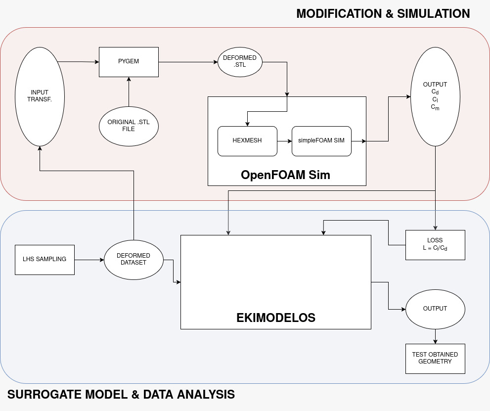
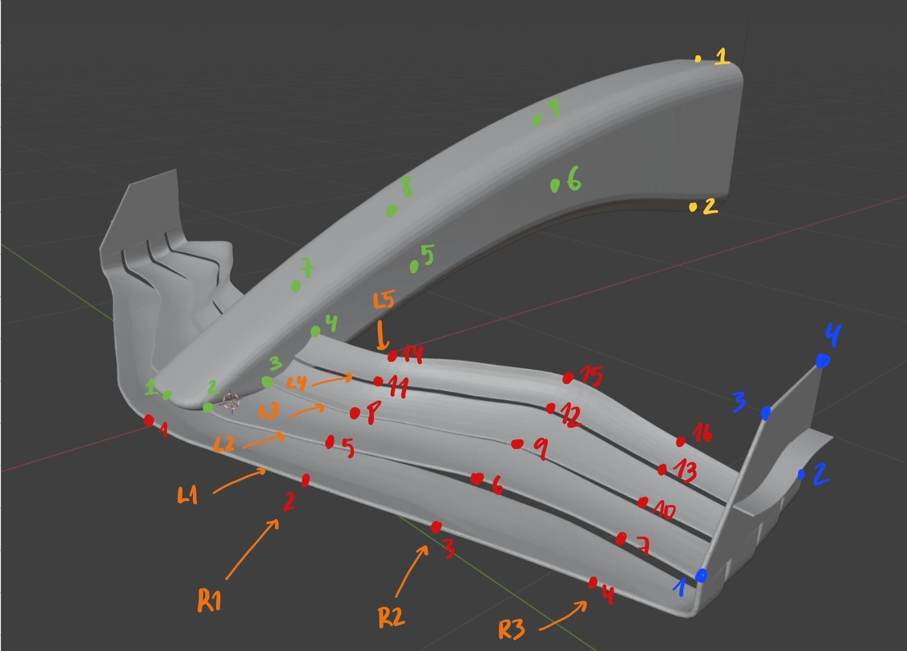
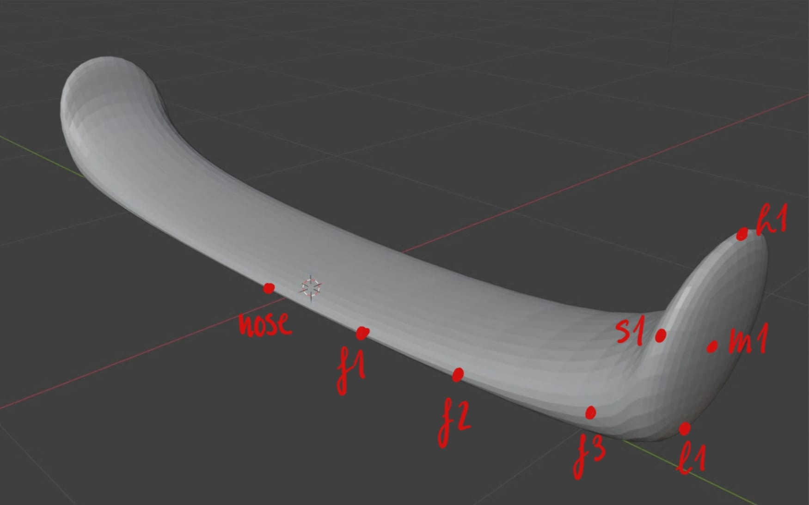
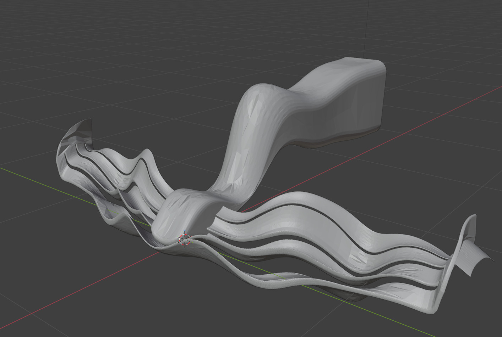
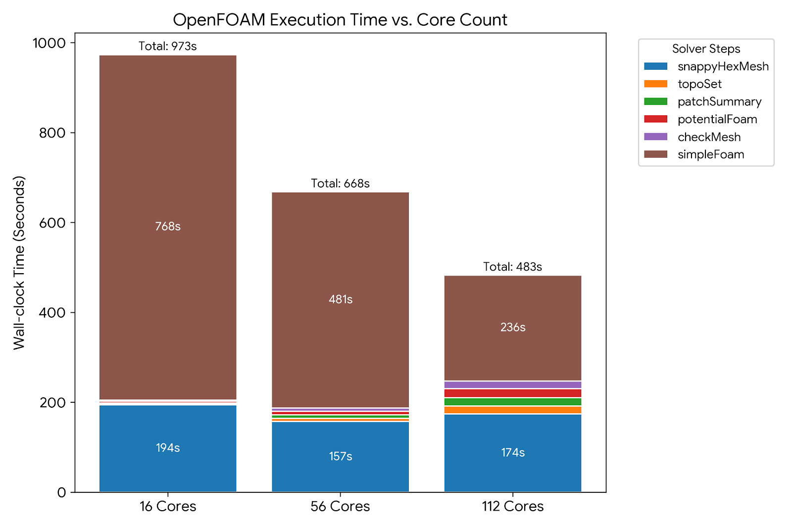
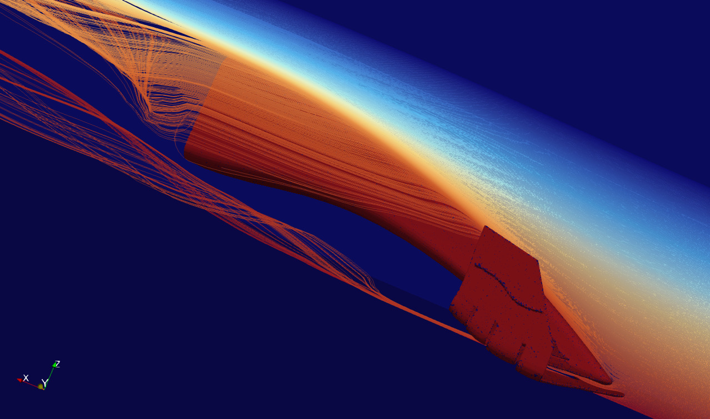

# aFasterSurrogateCar

This project presents a computational aerodynamics pipeline designed to optimize the Lift-to-Drag ratio (Cl​/Cd​) of a wing. The pipeline procedurally generates geometric deformations, runs Computational Fluid Dynamics (CFD) simulations, and leverages surrogate modeling to identify the optimal wing geometry.

The initiative originated from a desire to tackle a geometry optimization problem, such as minimizing material usage, maximizing structural robustness, or improving aerodynamic efficiency. We ultimately chose the latter, focusing on optimizing a Formula 1 (F1) front wing to maximize its Cl​/Cd​ ratio. During the initial planning phase, it became clear that the primary bottleneck would be computational cost, specifically the time required to execute the CFD simulations.

To mitigate this, we implemented a surrogate modeling approach. A surrogate model acts as an approximation, predicting the output of a computationally expensive process at a fraction of the cost. Because simulating wings using OpenFOAM was highly resource-intensive, a surrogate model capable of accurately predicting aerodynamic performance would allow us to significantly reduce computing costs by only simulating the most promising geometries.

Prior to the full-scale simulations, we designed a simplified surrogate object with a shape resembling the actual wing. This allowed us to run much faster pilot simulations and begin testing our modeling pipeline immediately while the computationally heavy F1 wing simulations were processing.

Training the final model required a robust dataset of CFD simulations. We needed to generate a wide variety of wing geometries that maintained physical viability. To achieve this, we applied Radial Basis Functions (RBF) to control points located in critical areas along the wing's surface. We then deformed the geometry by displacing these points using Latin Hypercube Sampling (LHS), ensuring a uniform distribution and diverse range of deformations.

This method produced a dataset of approximately 350 .stl files representing different wing variations. These geometries were simulated using OpenFOAM at the Barcelona Supercomputing Center (BSC). Over several days of simulation, we compiled our final dataset, pairing each geometric deformation with its corresponding aerodynamic scores.

Training a surrogate model to accurately predict simulation outputs proved more challenging than anticipated. Despite analyzing and testing numerous modeling strategies, the best performance we achieved was an R2 score of approximately 0.45 and a Spearman's rank correlation coefficient (ρ) of roughly 0.66. Given the substantial time invested by our team, these results were underwhelming. However, we remain optimistic and are currently exploring alternative modeling approaches while consulting with experienced professors to refine our methodology.

Despite the surrogate model's limitations, our sampling methodology was highly successful. The initial LHS sampling identified several strong deformations that yielded an 8% higher Lift-to-Drag ratio than the baseline wing. By generating additional samples around these top-performing geometries, we iteratively improved the aerodynamic efficiency, ultimately achieving a 17.8% improvement over the original wing.

At present, the project is paused while we investigate better strategies for training the surrogate model to realize our originally intended framework. Nevertheless, we are extremely pleased with the optimization results obtained and have extracted highly valuable experience in computational fluid dynamics and machine learning pipelines from this project.

## How does it work

The complete pipeline follows a rigorous process from geometry generation to machine learning optimization. Currently, the geometry generation and validation modules are fully implemented.



### 1. Design of Experiments (LHS)
To ensure we explore the design space efficiently without generating redundant wing shapes, we use **Latin Hypercube Sampling (LHS)** via `scipy.stats.qmc`. This generates a highly uniform distribution of deformation parameters.


### 2. Wing Deformation (RBF)
The core manipulation is handled by `wing_deformer.py`, which utilizes **Radial Basis Functions (RBF)** from the PyGeM library. By defining anchor points and control points on the original wing geometry (`FrontWing.stl`), we can seamlessly warp the mesh to flare endplates, steepen flaps, or adjust nose height without breaking the underlying surface smoothness.

<!---->

*Safety Feature:* The deformer includes a floor collision avoidance system. If a deformation pushes the wing too close to the ground (below the safe clearance), it automatically shifts the entire mesh upward along the Z-axis.

### 3. Mesh Validation for CFD
Before any geometry is sent to the supercomputer, it must pass a strict validation check in `generate_dataset.py`. The script evaluates the STL for:
* Watertightness (no holes or non-manifold edges)
* Consistent face winding (normals pointing outward)
* Positive volume (ensuring the RBF didn't crush or invert the mesh)

Invalid meshes (like the one below) are automatically rejected and logged, saving valuable compute hours.


### 4. CFD Simulation on MN5 (WIP)
Valid meshes are passed to **OpenFOAM** running on the MareNostrum 5 (MN5) supercomputer. The aerodynamics of the wing are simulated to extract Lift ($C_l$) and Drag ($C_d$) coefficients.



### 5. Surrogate Modeling (WIP)
Because running OpenFOAM on thousands of variations is computationally expensive, the resulting dataset will be used to train a **Surrogate Model** (e.g., Neural Network or Gaussian Process). This model will quickly predict the $C_l/C_d$ ratio for new parameter combinations, allowing us to find the optimal shape in seconds rather than days.

---

## How to use it

### Repository Structure
* **`generate_dataset.py`**: The main driver for bulk-generating wing variations. It applies LHS, calls the deformer, validates the meshes, and logs successful generations.
* **`wing_deformer.py`**: The RBF deformation engine. Can be used standalone or imported into other scripts.
* **`extract_to_json.py`**: A utility script to parse a specific row from a generated `parameters_log.csv` and convert it into a JSON configuration for easy reproducibility.
* **`main.py`**: A simple testing script to try out individual tweaks quickly.

---

## An example usage

### 1. Generating a Dataset
To generate a batch of wings using Latin Hypercube Sampling and automatically validate them for CFD:
```bash
python generate_dataset.py
```

This will create a Wings_Dataset/ directory containing the valid STLs and a CSV log.
### 2. Extracting a specific configuration

If you find a wing in your dataset that performed exceptionally well (or poorly) and want to extract its exact parameters:
```Bash
python extract_to_json.py -c parameters_log.csv -r 5 -o my_tweaks.json
# (Where -r 5 is the 5th wing generated in your dataset).
```
### 3. How to use the Wing Deformer manually
From the terminal:

With plotting enabled (to visually inspect the deformation):
Bash

```bash
python wing_deformer.py -i FrontWing.stl -o DeformedWing.stl -t tweaks.json -p
```
Without plotting (runs silently, faster for automated generation):
Bash
```bash
python wing_deformer.py -i FrontWing.stl -o DeformedWing.stl -t tweaks.json
```
From a Python script:

```python
from wing_deformer import apply_wing_deformations

# Define your tweaks right in the code
my_tweaks = [
    {"action": "flare_endplates", "amount": 40},
    {"action": "adjust_nose_height", "amount": 50}
]

# Run it! Set show_plot=False to keep it running quietly in the background
final_stl = apply_wing_deformations(
    input_stl="FrontWing.stl", 
    output_stl="Variation_001.stl", 
    transforms=my_tweaks, 
    show_plot=False
)
